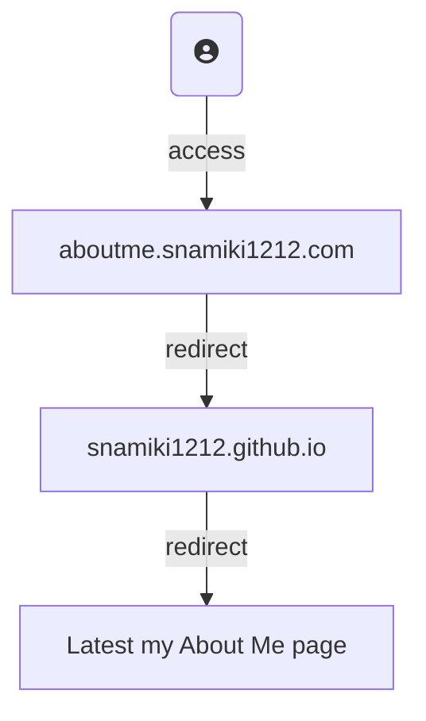

# [snamiki1212.github.io](https://snamiki1212.github.io/)

This repository manages my latest `About Me` page with redirecting from GitHub to another service.

## Page Jump Flowchart

## Versions

### v3

Used Notion Page feature

- [Site](https://snamiki1212.notion.site/AboutMe-bcbf1b16e6d045dbaa4f9ad1d4b2bc33)
- [Site:JA](https://snamiki1212.notion.site/Resume-db02ccdc211b4295b758bcac253077eb)
- No GitHub

### v2

Developed by myself

- [Site](https://snamiki1212.github.io/v2)
- [GitHub](https://github.com/snamiki1212/v2)

### v1

Used free template

- [Site](https://snamiki1212.github.io/v1)
- [GitHub](https://github.com/snamiki1212/v1)
